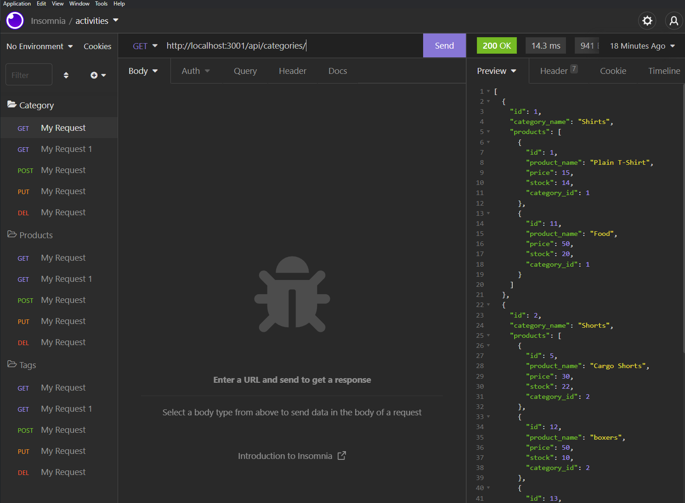

# E-commerce Back 

## The Motivation

This is challenge was a pleasure to get done. I really learne how to use routes and format models to make a e-commerce website

## Challenges

Getting all routes to work took some trial and error. The crud operations for each route kept giving me errors aned getting the right task to happen was a difficult task. Also this challenge has increased my awareness of what to look for when errors arise in these apps with numerous files

## Screenshot

## Walkthrough
https://drive.google.com/file/d/1sKSINCikuRwysKAMUUBnx3J1wW3XSkOr/view
